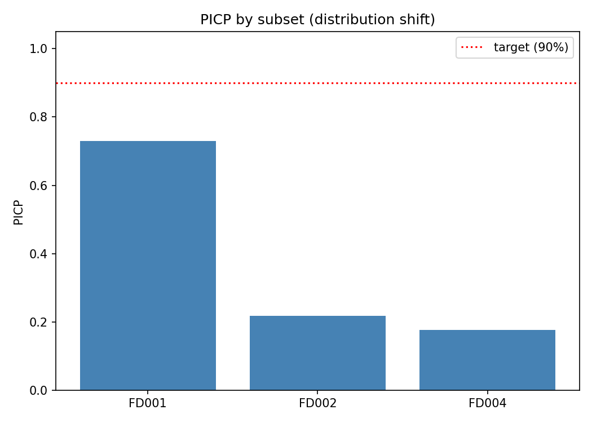
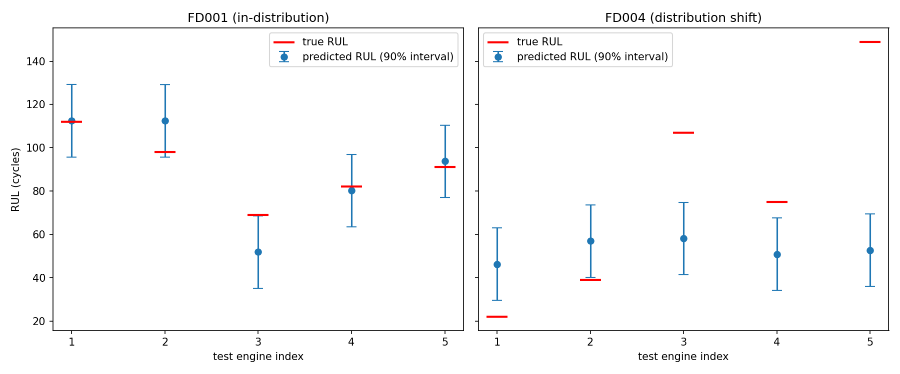

# calibrated-rul

A machine learning system that predicts the Remaining Useful Life (RUL) 
of jet engines from sensor data, wraps those predictions in statistically 
guaranteed confidence intervals using conformal prediction, and 
stress-tests interval reliability under distribution shift.

Built to explore a core question in industrial AI: does a model know 
when it doesn't know something?

---

## The Problem

Predictive maintenance systems need to answer two questions, not one:
1. *How long until this engine fails?*
2. *How confident are you in that estimate?*

Most published RUL models answer only the first. A model that says 
"47 cycles" with no uncertainty attached is dangerous in a real 
maintenance context — a 47 ± 5 estimate and a 47 ± 40 estimate lead 
to very different decisions about when to ground a plane.

This project addresses the second question using **conformal prediction** 
— a method that produces mathematically guaranteed coverage intervals 
without assuming anything about the underlying data distribution.

---

## The Experiment

**Training:** An LSTM trained on NASA C-MAPSS FD001 — 100 engines all 
running under a single operating condition (altitude, speed, throttle).

**Stress test:** The same frozen model and conformal calibration, run 
cold on FD002 and FD004 — 260 and 249 engines respectively, each 
operating under six different conditions the model has never seen.

**The question:** Does the model's stated 90% confidence hold up when 
it encounters unfamiliar data?

---

## Results

| Subset | Operating Conditions | RMSE (cycles) | PICP (target 90%) | Avg Interval Width |
|--------|---------------------|---------------|-------------------|-------------------|
| FD001  | 1 (in-distribution) | 14.5          | 73%               | 33.4 cycles       |
| FD002  | 6 (shifted)         | 56.8          | 21.7%             | 33.4 cycles       |
| FD004  | 6 (shifted)         | 61.8          | 17.7%             | 33.4 cycles       |

**Key finding:** Under distribution shift, prediction error increases 
4x (14.5 → 57–62 cycles) while interval width stays identical — the 
model produces falsely narrow confidence intervals on data it 
fundamentally doesn't understand, achieving only 18–22% coverage 
despite claiming 90%. This overconfidence failure is invisible from 
accuracy metrics alone; it only surfaces through calibration evaluation.




---

## Methods

**Model:** 2-layer LSTM (hidden size 64, dropout 0.2) trained on 
30-cycle sliding windows of 21 sensor readings. MSE loss, Adam 
optimizer, StepLR scheduler, early stopping (patience=10).

**Uncertainty:** Split conformal prediction — nonconformity scores 
computed on a held-out calibration set of 40 FD001 engines (never 
used in training), then applied as symmetric intervals at inference 
time.

**Evaluation metrics:**
- **RMSE** — average prediction error in cycles
- **PICP** (Prediction Interval Coverage Probability) — fraction of 
  true RUL values falling within predicted intervals
- **Sharpness** — average interval width (tighter is better, only if 
  coverage holds)

---

## Dataset

NASA C-MAPSS (Commercial Modular Aero-Propulsion System Simulation) 
turbofan engine degradation dataset.

- FD001: 100 train / 100 test engines, 1 operating condition
- FD002: 260 train / 259 test engines, 6 operating conditions  
- FD004: 249 train / 248 test engines, 6 operating conditions

Source: https://www.kaggle.com/datasets/behrad3d/nasa-cmaps

**Note:** This Kaggle mirror has a minor discrepancy from the original 
NASA paper for FD004 (249 train engines vs. the paper's reported 248). 
Verified not a labeling error — train trajectories average 246 cycles 
vs. test's 166 cycles, consistent with run-to-failure vs. truncated 
data respectively.

---

## Project Structure
calibrated-rul/

├── data/

│   ├── loader.py          # CMAPSSLoader — parses raw C-MAPSS files

│   └── preprocessor.py    # SequencePreprocessor — RUL capping,

│                          #   normalization, windowing, calib split

├── models/

│   ├── base.py            # BaseRULModel (abstract interface)

│   └── lstm_model.py      # LSTMRULModel implementation

├── uncertainty/

│   ├── base.py            # BaseUncertaintyWrapper (abstract interface)

│   └── conformal.py       # ConformalPredictor implementation

├── evaluation/

│   ├── metrics.py         # CalibrationEvaluator (RMSE, PICP, sharpness)

│   └── shift.py           # DistributionShiftAnalyzer

├── config.py              # Central config + build_model() factory

├── train.py               # Training orchestration

├── evaluate.py            # Evaluation + distribution shift test

└── outputs/               # Plots and saved model (model gitignored)

---

## Setup

```bash
# Clone the repo
git clone https://github.com/trentbolinger/calibrated-rul.git
cd calibrated-rul

# Install dependencies
pip install torch numpy pandas scikit-learn matplotlib kaggle

# Download dataset
kaggle datasets download -d behrad3d/nasa-cmaps -p data/raw --unzip
mv data/raw/CMaps/* data/raw/

# Train
python train.py

# Evaluate (includes distribution shift test)
python evaluate.py
```

---

## Hardware

Trained on an NVIDIA DGX Spark (GB10 GPU, CUDA 13.0).
